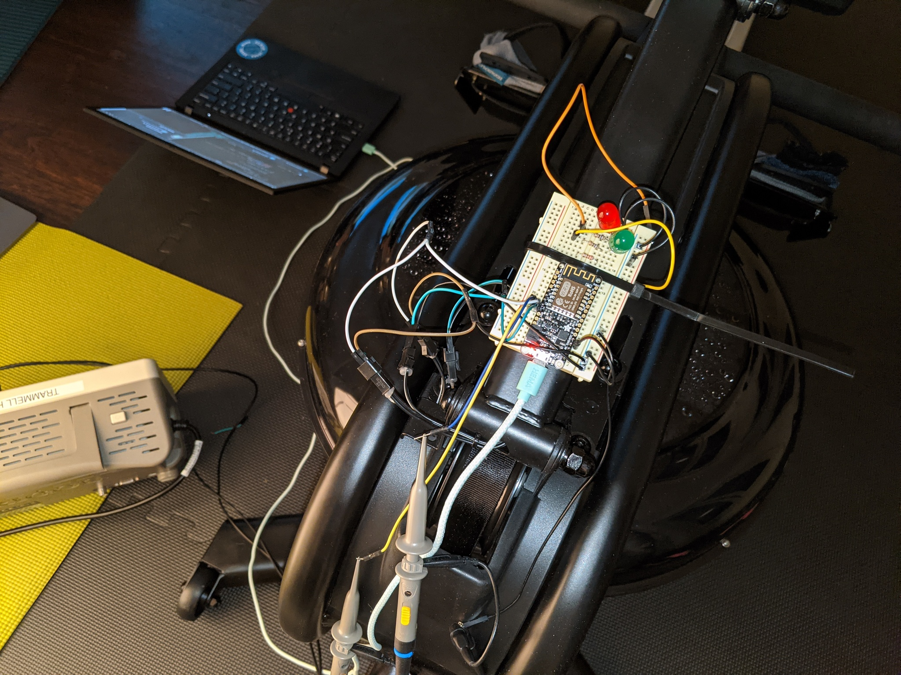
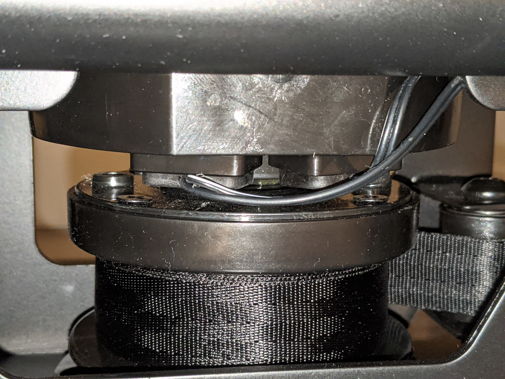
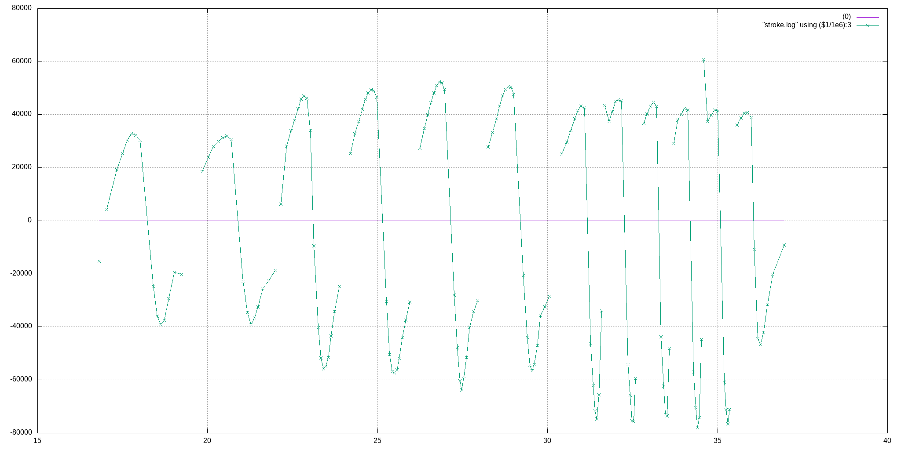

Adds an interface for the [Virtufit water resistance row 1000](https://virtufit.nl/product/virtufit-foldable-water-resistance-row-1000-roeitrainer/) rowing machine to provide custom stats.  

## Electrical Interface

Two magnetic sensors configured for quadrature encoding of
direction and velocity.  The cable spool has two magnets on it
and provides around nine data points on each stroke.

The sensors are connected to a 3.3V input pullup and pull the line
low when the magnet passes it.  There is a glitch when the magnet is
directly underneath, which can cause issues at low speed and requires
a debounce filter on the input.

## Software Interface

Serial 115200 baud, prints columns of data.

## Data Schema

A row is recorded at the end of each tick (after a magnet has passed the second sensor).

`workout_time_usec`
	Time since beginning of workout.

`stroke_time_usec`
	Time since beginning of current stroke.

`tick_duration_usec`
	Time it took for the magnet to pass from one sensor to the next (from falling edge on sensor A to falling edge of sensor B of the electrical signal).  Positive values are produced during the drive, and negative during the recovery.

`inst_drag`
	Instantaneous drag force.  Calculated by the speed of the belt squared, with the speed of the belt being calculated as the inverse of the tick duration.

`stroke_power`
	Integral of the drag forces for current stroke, calculated here with a running sum for simplicity.  

`inst_spm`
	Approximation of strokes per minute based on speed of previous stroke.

## BLE FTMS

TODO.

* https://www.bluetooth.com/specifications/specs/fitness-machine-service-1-0/
* https://jjmtaylor.com/post/fitness-machine-service-ftms/
* https://www.instructables.com/DIY-Indoor-Bike-Smart-Trainer/?cb=1604870523

